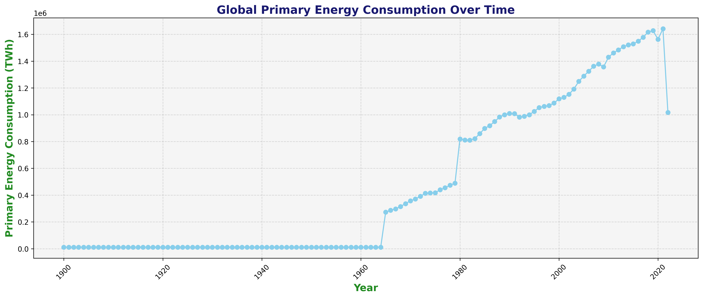
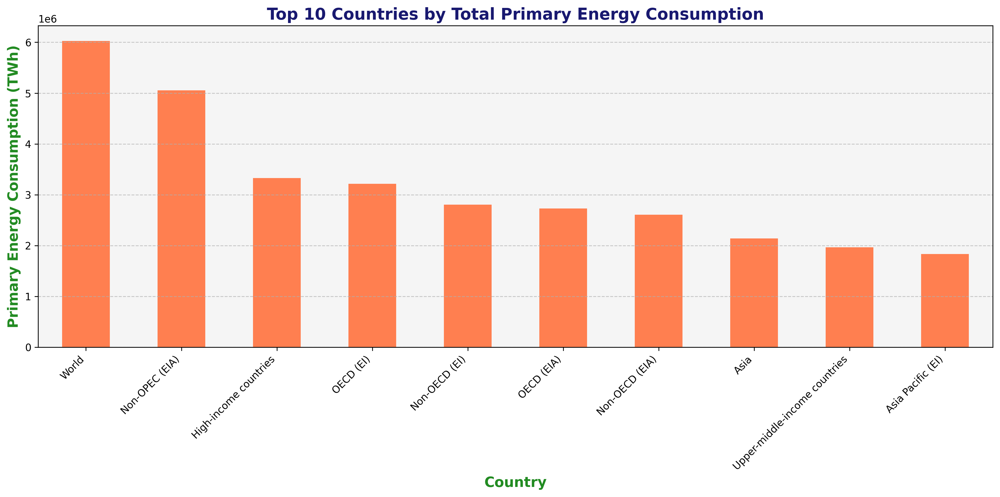
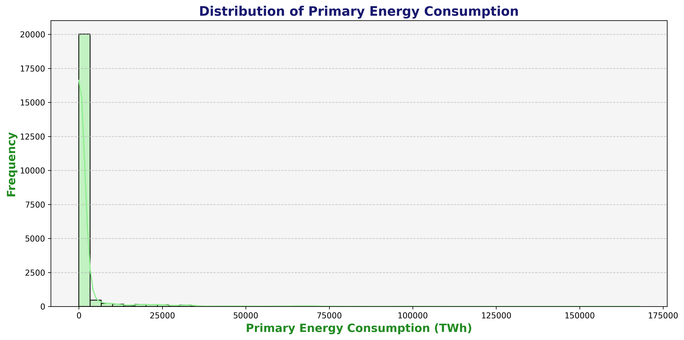
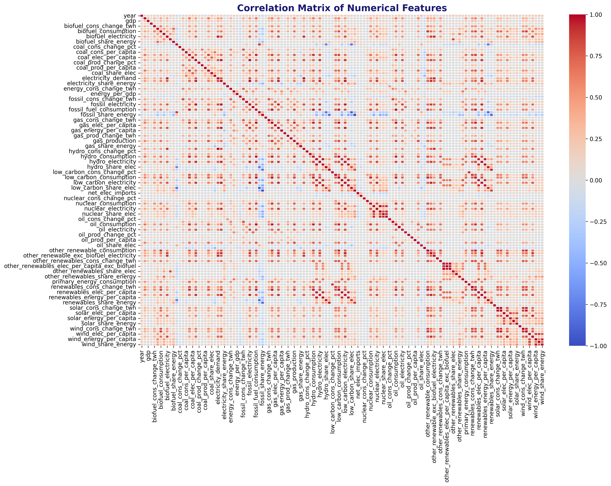
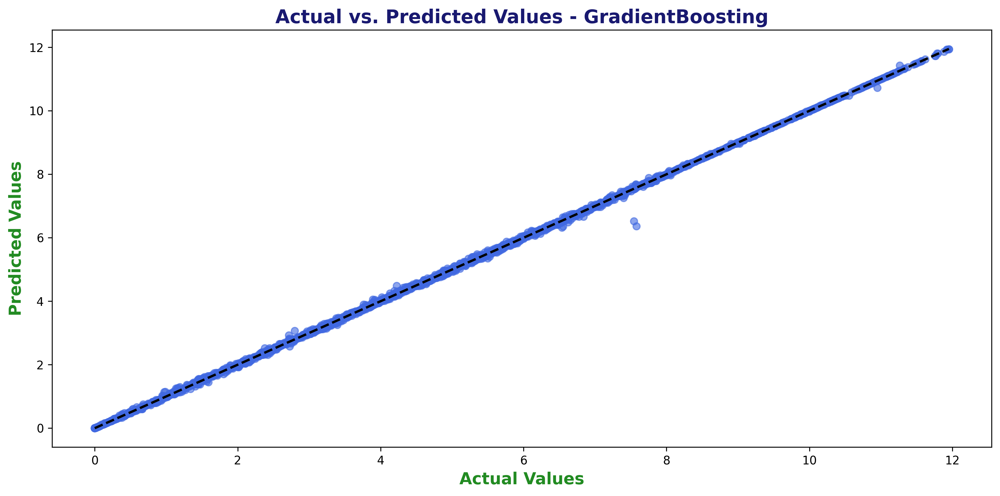
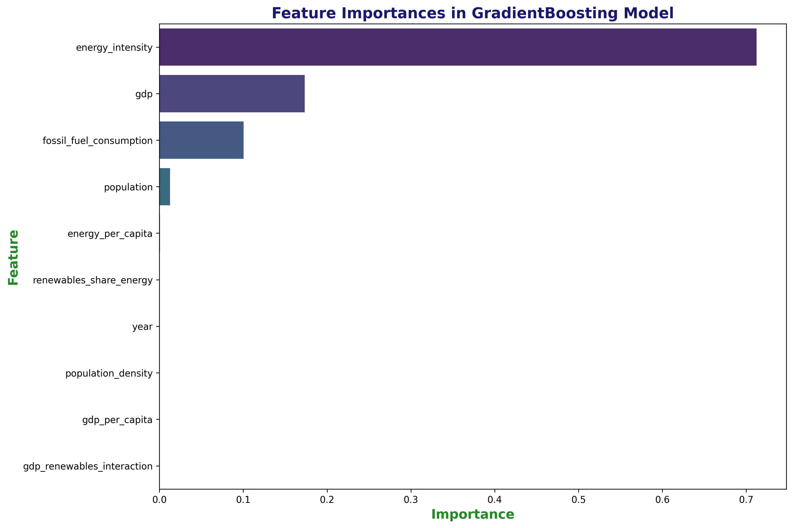

# 🌍 Energy Consumption Analysis Project

A comprehensive machine learning project analyzing global energy consumption patterns and predicting future energy usage using advanced regression models and data visualization techniques.

<div align="center">

[](https://energy-con.streamlit.app/)
[](https://www.python.org/downloads/)
[](https://scikit-learn.org/)
[](https://plotly.com/)

</div>

## 🚀 Live Demo
**[🌐 Try the Interactive Dashboard](https://energy-con.streamlit.app/)**

Experience the full analysis with interactive model testing, predictions, and visualizations!

## 📋 Table of Contents
- [Live Demo](#live-demo)
- [Project Overview](#project-overview)
- [Dataset](#dataset)
- [Project Structure](#project-structure)
- [Notebooks](#notebooks)
- [Visualizations](#visualizations)
- [Models](#models)
- [Key Features](#key-features)
- [Results](#results)
- [Installation & Usage](#installation--usage)
- [Technologies Used](#technologies-used)
- [Future Improvements](#future-improvements)

## 🎯 Project Overview

This project analyzes historical energy consumption data to understand global energy trends and predict future consumption patterns. The analysis includes comprehensive exploratory data analysis (EDA), advanced feature engineering, and multiple machine learning models to achieve high prediction accuracy.

**Main Objectives:**
- Analyze global energy consumption patterns and trends
- Identify key factors affecting energy usage
- Build predictive models for energy consumption forecasting
- Visualize energy data through interactive and static plots
- Compare different machine learning approaches

## 📊 Dataset

**Source:** [Kaggle - World Energy Consumption Dataset](https://www.kaggle.com/datasets/pralabhpoudel/world-energy-consumption)

**Dataset Details:**
- **Size:** 22,012 rows × 129 columns
- **Time Range:** Historical energy consumption data by country and year
- **Key Features:** GDP, population, energy per capita, renewable energy share, fossil fuel consumption
- **Target Variable:** Primary energy consumption (TWh)

## 📁 Project Structure

```
Energy_Consumption_Analysis/
├── README.md
├── Energy_Consumption_Analysis.ipynb          # Main analysis notebook
├── Improved_Energy_Consumption_Prediction.ipynb  # Advanced modeling notebook
├── World Energy Consumption.csv              # Dataset
├── images/                                   # Generated visualizations
│   ├── global_energy_consumption_over_time.png
│   ├── top_countries_energy_consumption.png
│   ├── correlation_matrix.png
│   ├── feature_importances.png
│   ├── actual_vs_predicted.png
│   └── ... (14 total visualizations)
└── models/                                   # Trained models
    ├── best_model.pkl
    ├── gradientboosting_model.pkl
    ├── randomforest_model.pkl
    └── ... (13 total model files)
```

## 📓 Notebooks

### 1. Energy_Consumption_Analysis.ipynb
**Primary analysis notebook focusing on:**
- Comprehensive exploratory data analysis (EDA)
- Data cleaning and preprocessing
- Feature engineering and selection
- Random Forest model training with GridSearchCV
- Extensive data visualizations

**Key Sections:**
1. 🧠 Problem Definition
2. 🗂️ Data Collection & Preparation
3. 📊 Exploratory Data Analysis
4. 📐 Feature Engineering
5. 🔀 Data Splitting
6. 🤖 Model Selection & Training
7. 📈 Model Evaluation
8. 🔧 Model Improvement

### 2. Improved_Energy_Consumption_Prediction.ipynb
**Advanced modeling notebook featuring:**
- Enhanced feature engineering with interaction terms
- Multiple regression model comparison
- Advanced hyperparameter tuning with RandomizedSearchCV
- Comprehensive model evaluation and comparison

**Key Improvements:**
- GDP per capita calculation
- Energy intensity metrics
- Population density features
- Log transformation of skewed features
- 5-model comparison (Linear, Ridge, Lasso, Random Forest, Gradient Boosting)

## 🖼️ Visualizations

### Generated Images (14 total)

#### **📸 Sample Visualizations:**

<div align="center">

| Global Energy Trends | Top Energy Consumers |
|:---:|:---:|
|  |  |

| Energy Distribution | Correlation Analysis |
|:---:|:---:|
|  |  |

| Model Performance | Feature Importance |
|:---:|:---:|
|  |  |

</div>

#### **Exploratory Data Analysis Plots:**

1. **`global_energy_consumption_over_time.png`**
   - Line plot showing global energy consumption trends over time
   - Reveals increasing energy demand patterns

2. **`top_countries_energy_consumption.png`**
   - Bar chart of top 10 energy-consuming countries
   - Highlights major energy consumers globally

3. **`energy_consumption_distribution.png`**
   - Histogram with KDE showing energy consumption distribution
   - Reveals data distribution characteristics

4. **`correlation_matrix.png`**
   - Heatmap of feature correlations (16×12 size)
   - Identifies relationships between numerical variables

5. **`energy_consumption_vs_gdp.png`**
   - Scatter plot analyzing relationship between GDP and energy consumption
   - Shows economic-energy consumption correlation

6. **`energy_consumption_by_year_boxplot.png`**
   - Box plots showing energy consumption distribution by year
   - Reveals yearly variation patterns

7. **`energy_consumption_by_source.png`**
   - Stacked area chart of energy consumption by source (coal, gas, oil, hydro, nuclear, renewables)
   - Shows energy mix evolution over time

8. **`renewables_share_over_time.png`**
   - Line plot of renewable energy share trends
   - Tracks renewable energy adoption

9. **`energy_per_capita_vs_gdp_per_capita.png`**
   - Scatter plot comparing per capita metrics
   - Analyzes individual country efficiency

#### **Interactive Visualization:**

10. **`world_energy_consumption_choropleth.html`**
    - Interactive Plotly choropleth map
    - Animated world map showing energy consumption by country over time
    - Color-coded by consumption levels with time slider

#### **Model Performance Plots:**

11. **`feature_importances.png`** (Random Forest)
    - Horizontal bar chart showing feature importance from Random Forest model
    - Identifies most predictive variables

12. **`actual_vs_predicted.png`** (Random Forest)
    - Scatter plot comparing actual vs predicted values
    - Includes perfect prediction line for reference

13. **`feature_importances_gradientboosting.png`**
    - Feature importance visualization for Gradient Boosting model
    - Shows variable significance in best-performing model

14. **`actual_vs_predicted_gradientboosting.png`**
    - Prediction accuracy plot for Gradient Boosting model
    - Demonstrates model performance quality

## 🤖 Models

### Saved Models (13 files)

#### **Individual Trained Models:**
- `linearregression_model.pkl` - Linear Regression baseline
- `ridge_model.pkl` - Ridge Regression with L2 regularization
- `lasso_model.pkl` - Lasso Regression with L1 regularization
- `randomforest_model.pkl` - Random Forest ensemble model
- `gradientboosting_model.pkl` - Gradient Boosting ensemble model

#### **Hyperparameter Search Objects:**
- `ridge_gridsearch.pkl` - Ridge hyperparameter search results
- `lasso_gridsearch.pkl` - Lasso hyperparameter search results
- `randomforest_gridsearch.pkl` - Random Forest hyperparameter search results
- `gradientboosting_gridsearch.pkl` - Gradient Boosting hyperparameter search results
- `grid_search_cv.pkl` - Original Random Forest GridSearchCV object

#### **Best Models:**
- `best_model.pkl` - Best performing model (Gradient Boosting)
- `best_random_forest_model.pkl` - Best Random Forest from original analysis

#### **Performance Data:**
- `model_performance_comparison.csv` - Comparison of all model R² scores

## ✨ Key Features

### **Data Processing:**
- Comprehensive missing value imputation
- Robust handling of infinite values
- Feature scaling and normalization
- Log transformation for skewed features

### **Feature Engineering:**
- GDP per capita calculation
- Energy intensity metrics
- Population density features
- Interaction terms (GDP × renewables share)
- Time-based feature extraction

### **Model Development:**
- Multiple algorithm comparison
- Advanced hyperparameter tuning
- Cross-validation for robust evaluation
- Feature importance analysis

### **Visualization:**
- 13 static high-quality plots (300 DPI)
- 1 interactive choropleth map
- Comprehensive EDA visualizations
- Model performance comparisons

## 📈 Results

### **Model Performance Comparison:**

| Model | R² Score | Performance |
|-------|----------|-------------|
| **Gradient Boosting** | **0.9998** | 🏆 **Best** |
| Random Forest | 0.9992 | Excellent |
| Ridge Regression | 0.5046 | Moderate |
| Lasso Regression | 0.4933 | Moderate |
| Linear Regression | 0.4928 | Baseline |

### **Key Insights:**
- **Gradient Boosting** achieved exceptional performance (R² = 0.9998)
- **Tree-based models** significantly outperformed linear models
- **Feature engineering** substantially improved model accuracy
- **Energy per capita** and **GDP** are key predictive features
- **Renewable energy share** shows increasing global trends

## 🚀 Installation & Usage

### **🌐 Option 1: Try the Live Demo (Recommended)**
**[🔗 Interactive Streamlit Dashboard](https://energy-con.streamlit.app/)**

No installation required! Access the full interactive dashboard with:
- Model testing and comparison
- Real-time predictions
- Interactive visualizations
- Data exploration tools

### **💻 Option 2: Local Installation**

#### **Prerequisites:**
```bash
pip install pandas numpy scikit-learn matplotlib seaborn plotly joblib streamlit
```

#### **Running the Analysis:**

1. **Clone the repository:**
```bash
git clone <repository-url>
cd Energy_Consumption_Analysis
```

2. **Run the Streamlit app locally:**
```bash
streamlit run app.py
```

3. **Or run the Jupyter notebooks:**
```bash
jupyter notebook Energy_Consumption_Analysis.ipynb
jupyter notebook Improved_Energy_Consumption_Prediction.ipynb
```

### **Loading Saved Models:**
```python
import joblib

# Load the best model
best_model = joblib.load('models/best_model.pkl')

# Make predictions
predictions = best_model.predict(X_new)
```

## 🛠️ Technologies Used

- **Python 3.x**
- **Data Analysis:** pandas, numpy
- **Machine Learning:** scikit-learn
- **Visualization:** matplotlib, seaborn, plotly
- **Model Persistence:** joblib
- **Development:** Jupyter Notebook

## 🔮 Future Improvements

### **Potential Enhancements:**
- **Time Series Analysis:** ARIMA, LSTM models for temporal patterns
- **Deep Learning:** Neural networks for complex pattern recognition
- **Ensemble Methods:** Stacking and blending techniques
- **Feature Selection:** Advanced feature selection algorithms
- **Real-time Prediction:** API development for live predictions
- **Geographic Analysis:** Spatial clustering and regional modeling
- **Sustainability Metrics:** Carbon footprint and environmental impact analysis

### **Additional Visualizations:**
- Time series decomposition plots
- Regional energy consumption maps
- Energy source transition animations
- Predictive scenario modeling

---

## 📊 Project Statistics

- **Total Code Lines:** ~1,400+ lines across both notebooks
- **Visualizations Generated:** 14 (13 PNG + 1 HTML)
- **Models Trained:** 5 different algorithms
- **Model Files Saved:** 13 files
- **Dataset Size:** 22K+ records, 129 features
- **Best Model Accuracy:** R² = 0.9998

---

**📧 Contact:** For questions or collaboration opportunities, please reach out!

**🌟 Star this repository if you found it helpful!**
